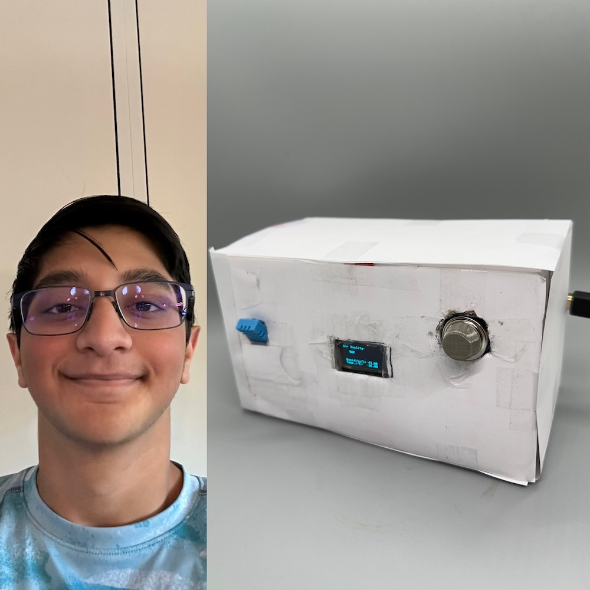
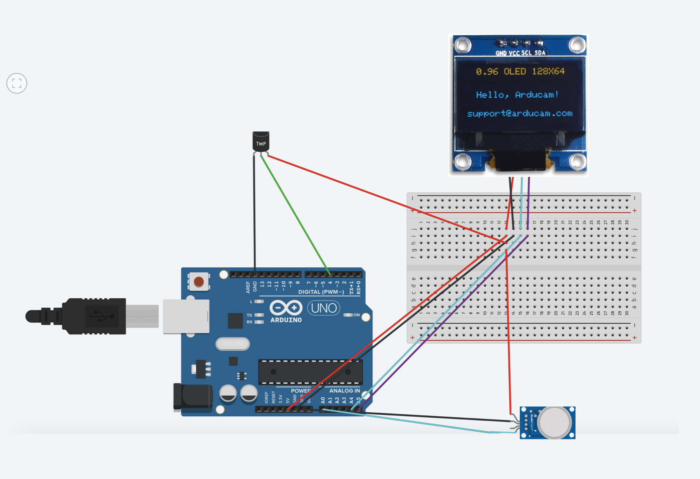

# Air Quality Monitor

My project is an air quality monitor. This is inspired by not only the New York-Canada smoky skies, but also the 2020 Northern California fires which caused similar results. My biggest challenge was making multiple pieces of code work together cohesively and make a working project. It was a very fun project to make, as it also involved a lot of building. I really enjoy building and doing hands-on work, so this project was really fun. The point of this project is that it can be used everyday, and can be very important in an emergency.


| **Engineer** | **School** | **Area of Interest** | **Grade** |
|:--:|:--:|:--:|:--:|
| Aditya B. | BASIS Independent Silicon Valley | Mechanical Engineering | Incoming Freshman



  
# Final Milestone

<iframe width="560" height="315" src="https://www.youtube.com/embed/J9NykD2Khdk" title="YouTube video player" frameborder="0" allow="accelerometer; autoplay; clipboard-write; encrypted-media; gyroscope; picture-in-picture; web-share" allowfullscreen></iframe>


My final milestone was to finish building the shell and ensure the code was running properly. Overall, this has been a very successful project. My enclosure is sturdy and masks the internal components very well. One major challenge I faced was finding ways to ensure good readings. Occasionally, there would be some deviation from the standard measurements. Fortunately, I was able to fix this by finding an optimal power level and correct wiring. Personally, I'm very proud of the enclosure. Mechanical engineering is my stronger area, so being able to build a shell completely from scratch was my favorite part of this project. 

Overall, I've learned how to better code with Arduino. I had some experience to begin with, but going head first into a fully Arduino based project helped me understand how different pieces of code correspond to real-life functions. In future, I want to work on more projects like this. I'll probably make another sensor, as this can genuinely help a lot of people.


# Second Milestone

<iframe width="560" height="315" src="https://www.youtube.com/embed/QPm4-cT0WwI?controls=0" title="YouTube video player" frameborder="0" allow="accelerometer; autoplay; clipboard-write; encrypted-media; gyroscope; picture-in-picture; web-share" allowfullscreen></iframe>


My second milestone was getting the DHT11 sensor to work and put the reading on the OLED. I also wanted to move components from the large breadboard to the smaller breadboard, so that it would be more convenient to hang up. Both these goals have been achieved. A major challenge was that the sensor initially didn't work but that was resolved. A modification I want to make is adding an IR sensor so that the monitor can be remote controlled. One of the last things to complete as well is an exterior shell so that it looks somewhat attractive. 

# First Milestone


<iframe width="560" height="315" src="https://www.youtube.com/embed/-2YUkWNatrY?controls=0" title="YouTube video player" frameborder="0" allow="accelerometer; autoplay; clipboard-write; encrypted-media; gyroscope; picture-in-picture; web-share" allowfullscreen></iframe>


My project is an air quality monitor with a temperature and humidity sesnor. My first milestone was to get data from the MQ135 sensr and present it on the OLED. After a few tries and some code editing, I finally managed to achieve this. Through the code editing, I was also able to make the data go to the serial monitor as well, in case the OLED malfunctions. My next milestone is to get the humidity and temperature senor connected and presenting the data on the OLED as well. So far, one of my challenges has been figuring out the safe ranges of the MQ135 sensor as it isn't a traditional AQI sensor. I will try and research as much as possible to figure this out and present that on the OLED. 

# Schematics 



# Code
The following code is c++

```
#include <SPI.h>
#include <Wire.h>
#include <Adafruit_GFX.h>
#include <Adafruit_SSD1306.h>
#include <dht11.h>


#define DHT11PIN 4
#define SCREEN_WIDTH 128
#define SCREEN_HEIGHT 64

#define OLED_RESET 4

#define sensor  A0

int gasLevel  = 0;
String quality ="";
Adafruit_SSD1306 display(SCREEN_WIDTH,  SCREEN_HEIGHT, &Wire, OLED_RESET);
dht11 DHT11;

void setup() {
  Serial.begin(9600);
  if (!display.begin(SSD1306_SWITCHCAPVCC, 0x3C)) {
    Serial.println(F("Allocation failed, check circuit and code"));
    for(;;);
  }

  
  display.setTextSize(1.5);
  display.setCursor(50,0);

  display.clearDisplay();
  delay(1500);
}


void air_sensor()
{
  gasLevel = analogRead(sensor);
  quality = gasLevel;

  display.setTextColor(WHITE);
  display.setTextSize(1);  
  display.setCursor(1,7);
  display.setFont();
  display.println("Air Quality:");
  display.setTextSize(1);
  display.setCursor(20,23);
  display.setTextSize(1.5);
  display.println(quality); 

}


void loop() {
  // put your main code here, to run repeatedly:
  display.clearDisplay();
  air_sensor();
  Serial.println(quality);
  Serial.println();
  int chk = DHT11.read(DHT11PIN);
  Serial.print("Humidity (%): ");
  display.setCursor(7,48);
  display.println("Humidity(%):");
  display.setCursor(80, 48);
  display.print((float)DHT11.humidity, 2);
  Serial.println((float)DHT11.humidity, 2);
  display.setTextSize(0.01);
  display.setCursor(7,57);
  display.println("Temp.('C)  :");
  display.setCursor(80,57);
  display.print((float)DHT11.temperature, 2);
  Serial.print("Temperature  (C): ");
  Serial.println((float)DHT11.temperature, 2);
  display.display();
  delay(1500);

}


# Bill of Materials
Here's where you'll list the parts in your project. To add more rows, just copy and paste the example rows below.
Don't forget to place the link of where to buy each component inside the quotation marks in the corresponding row after href =. Follow the guide [here]([url](https://www.markdownguide.org/extended-syntax/)) to learn how to customize this to your project needs. 

| **Part** | **Note** | **Price** | **Link** |
|:--:|:--:|:--:|:--:|
| Item Name | What the item is used for | $Price | <a href="https://www.amazon.com/Arduino-A000066-ARDUINO-UNO-R3/dp/B008GRTSV6/"> Link </a> |
| Item Name | What the item is used for | $Price | <a href="https://www.amazon.com/Arduino-A000066-ARDUINO-UNO-R3/dp/B008GRTSV6/"> Link </a> |
| Item Name | What the item is used for | $Price | <a href="https://www.amazon.com/Arduino-A000066-ARDUINO-UNO-R3/dp/B008GRTSV6/"> Link </a> |

# Other Resources/Examples
One of the best parts about Github is that you can view how other people set up their own work. Here are some past BSE portfolios that are awesome examples. You can view how they set up their portfolio, and you can view their index.md files to understand how they implemented different portfolio components.
- [Example 1](https://trashytuber.github.io/YimingJiaBlueStamp/)
- [Example 2](https://sviatil0.github.io/Sviatoslav_BSE/)
- [Example 3](https://arneshkumar.github.io/arneshbluestamp/)

To watch the BSE tutorial on how to create a portfolio, click here.
